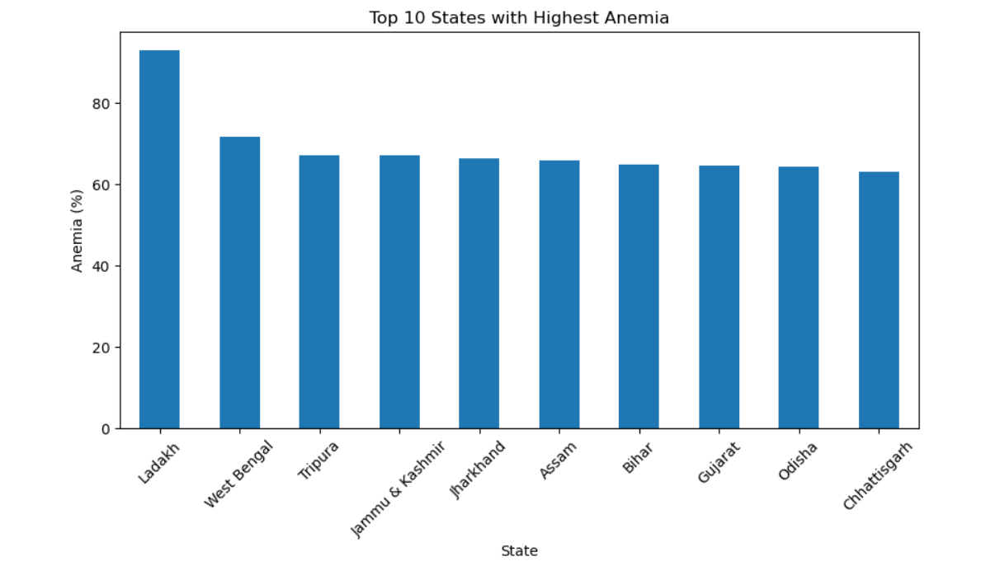
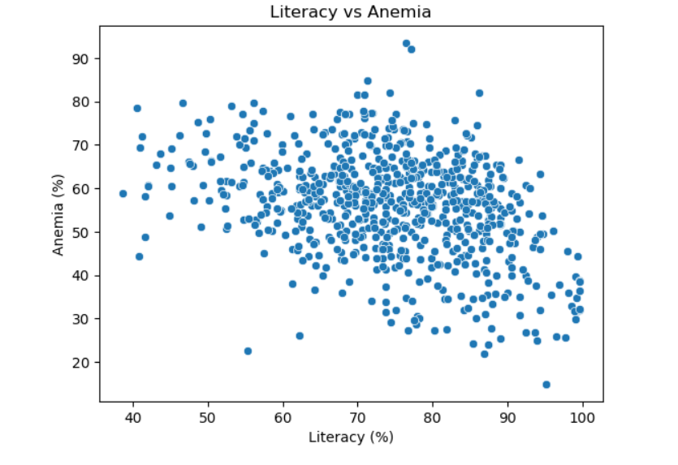
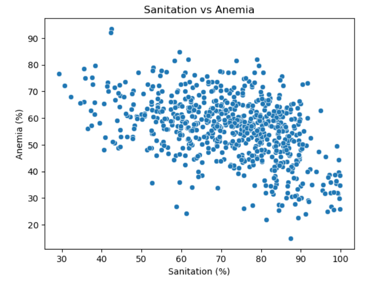
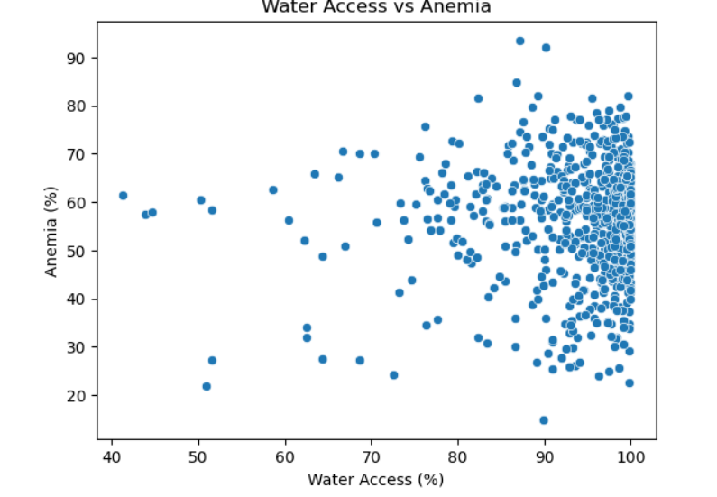
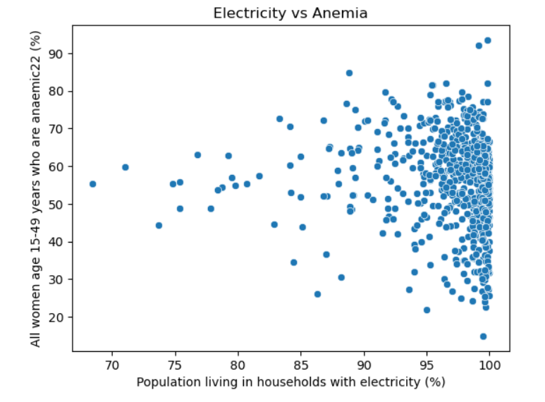
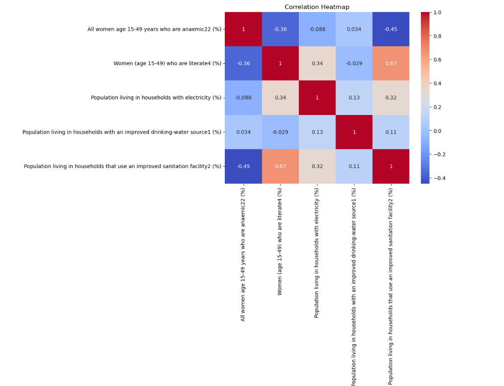
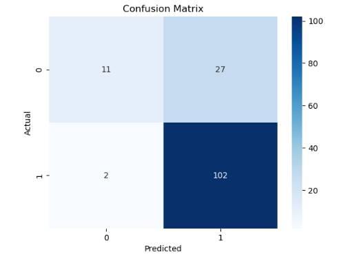
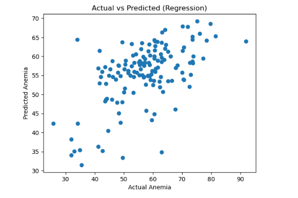

# 🩺 Health Inequality & Anemia Prediction (NFHS-5)

## 📌 Overview

This project analyzes district-level health data from NFHS-5 to understand factors affecting anemia among women in India and builds machine learning models for prediction.

## 🎯 Objectives

* Analyze health inequality across districts
* Identify factors influencing anemia
* Build classification and regression models

## 📊 Dataset

* Source: NFHS-5 (National Family Health Survey)
* Level: District-level data across India
* Features:

  * Literacy
  * Sanitation
  * Water access
  * Electricity

## 🧹 Data Cleaning

* Removed missing values and duplicates
* Selected relevant features
* Converted data types where necessary

## 📈 Exploratory Data Analysis

* State-wise anemia analysis
* District-level hotspots identification
* Relationship analysis:

  * Literacy vs Anemia
  * Sanitation vs Anemia
  * Water Access vs Anemia
  * Electricity vs Anemia
* Correlation heatmap

## 🤖 Machine Learning Models

### 1. Classification

* Model: Logistic Regression
* Goal: Predict high anemia districts
* Accuracy: ~79%

### 2. Regression

* Model: Random Forest Regressor
* Goal: Predict anemia percentage
* MAE: ~7.25

## 🔍 Key Insights

* Literacy has a negative correlation with anemia
* Better sanitation and water reduce anemia levels
* Health inequality exists across districts
* Infrastructure plays a key role in public health

## 📊 Visualizations

### 📍 Top 10 States with Highest Anemia


Shows the states with the highest anemia prevalence, highlighting regional health disparities across India.

---

### 📍 Literacy vs Anemia


Demonstrates a negative correlation between literacy and anemia — higher literacy rates are associated with lower anemia levels.

---

### 📍 Sanitation vs Anemia


Indicates that improved sanitation facilities are linked to reduced anemia prevalence.

---

### 📍 Water Access vs Anemia


Shows that better access to clean drinking water contributes to lower anemia levels.

---

### 📍 Electricity vs Anemia


Highlights the relationship between electricity access and anemia, suggesting infrastructure impacts health outcomes.

---

### 📍 Correlation Heatmap


Provides an overview of relationships between all variables, showing strong links between literacy, sanitation, and anemia.

---

### 📍 Confusion Matrix (Classification Model)


Evaluates classification performance, showing correct and incorrect predictions for anemia classification.

---

### 📍 Actual vs Predicted (Regression Model)


Compares predicted anemia values with actual values, indicating the model’s accuracy and spread.

## ⚙️ Tech Stack

* Python
* Pandas, NumPy
* Matplotlib, Seaborn
* Scikit-learn

## 🚀 How to Run

```bash id="y8fx8z"
pip install -r requirements.txt
jupyter notebook
```

## 👤 Author

Shivansh Dalvadi
